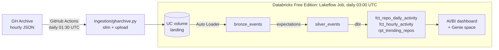

# GitHub Archive: End-to-End Data Pipeline

**What is the world building right now?** This project is an end-to-end lakehouse pipeline on
Databricks. It turns every public GitHub event from [GH Archive](https://www.gharchive.org)
(1.5–2 million a day: pushes, pull requests, stars, forks and releases) into trending-repo rankings
and activity analytics.



The Lakeflow pipeline after its first run: Auto Loader → `bronze_events` → `silver_events`,
320K events, all 5 data quality expectations met.


## Tech stack

| Layer | Tool |
|---|---|
| Ingestion | Python 3.12, httpx, orjson, Databricks SDK, run on **GitHub Actions** |
| Storage | **Unity Catalog** volume (landing) + **Delta Lake** tables with liquid clustering |
| Processing | **Auto Loader** + **Lakeflow Spark Declarative Pipelines** (PySpark, serverless) |
| Data quality | Pipeline **expectations**, **dbt** data tests, dbt **unit tests**, source freshness |
| Transformation | **dbt** (dbt-databricks) on a serverless SQL warehouse |
| Orchestration | **Lakeflow Jobs** (pipeline → dbt), GitHub Actions (ingestion) |
| Infra as code / CI/CD | **Declarative Automation Bundles** (formerly Asset Bundles) + GitHub Actions |
| Serving | **AI/BI dashboard** + **Genie** (natural-language questions over the gold tables) |
| Tooling | venv or conda, pip, **ruff**, **pytest** |

## Repository layout

```
databricks.yml                  bundle root: variables, dev/prod targets
resources/                      schema + volume, pipeline, and job definitions
ingestion/gharchive.py          extract: GH Archive -> slim -> UC volume (idempotent)
src/gharchive_etl/           Lakeflow pipeline: bronze_events.py, silver_events.py
src/models/                     dbt: staging view + gold marts (+ tests, unit tests)
src/macros/                     dbt macro for late-arriving-data-safe incremental models
dbt_project.yml, packages.yml   dbt project config
dbt_profiles/profiles.yml       dbt connection profiles (job + local)
tests/                          pytest suite for the ingestion code
requirements*.txt               Python dependencies (runtime, dev, local dbt)
.github/workflows/              ci.yml (lint/test/validate/deploy), ingest.yml (daily + backfills)
```

## The data

Measured by this pipeline on 8 hours of 2026-09-25 (00:00–05:00 and 12:00–13:00 UTC):

| | |
|---|---|
| Events | 37k–94k per hour depending on time of day (~1.5–2M/day) |
| Mix | PushEvent ~75–80%, CreateEvent ~12%, PullRequestEvent ~4%, DeleteEvent ~3% |
| Stars (WatchEvent) | ~100–130/hour: a sparse signal, so trending ties are broken by forks |
| Bots | 15–25% of all events; 58% of issue comments and 37% of PR events |
| Size | 110.5 MB raw gzip → 50.2 MB after slimming (−55%; 32–74% depending on the hour) |
| Duplicates | 1 repeated event ID in 319,803 events, caught by the dbt `unique` test |

Since GitHub's 2025 Events API changes, payloads are much thinner: pushes no longer list their
commits, and pull request merges arrive as `action = 'merged'`.

## Data model

| Table | Layer | Grain | Built by |
|---|---|---|---|
| `bronze_events` | bronze | one row per event, as landed | Auto Loader streaming table |
| `silver_events` | silver | one row per event, typed + validated | streaming table with expectations |
| `stg_gharchive__events` | staging | one row per event | dbt view |
| `fct_repo_daily_activity` | gold | repo × day | dbt incremental (merge) |
| `fct_hourly_activity` | gold | day × hour × event type | dbt incremental (merge) |
| `rpt_trending_repos` | gold | one row per trending repo | dbt table |

Bronze and silver live in `workspace.gharchive`; dbt writes gold to `workspace.gharchive_gold`.
The dev target uses `gharchive_dev` and `gharchive_dev_gold`.

## Getting started

### 1. One-time setup

1. Create a free account at [Databricks Free Edition](https://www.databricks.com/learn/free-edition).
2. Create a personal access token: **Settings → Developer → Access tokens**.
3. Install the Databricks CLI (Windows shown; on macOS/Linux use Homebrew or the curl installer):
   ```powershell
   winget install Databricks.DatabricksCLI
   ```
4. Authenticate the CLI (use your workspace URL):
   ```powershell
   databricks auth login --host https://<your-workspace>.cloud.databricks.com --profile DEFAULT
   ```
5. Create a Python environment and install dependencies, with **either** venv:
   ```powershell
   python -m venv .venv
   .venv\Scripts\Activate.ps1          # macOS/Linux: source .venv/bin/activate
   pip install -r requirements-dev.txt
   ```
   **or** conda:
   ```powershell
   conda create -n gharchive python=3.12 -y
   conda activate gharchive
   pip install -r requirements-dev.txt
   ```
6. Check everything works: `pytest` and `ruff check .`

### 2. Deploy and run in dev

```powershell
# Create the dev schema, landing volume, pipeline and job
databricks bundle deploy -t dev

# Land a few hours of data in the dev volume (start small: Free Edition has daily quotas)
python -m ingestion.gharchive --start 2026-09-01T00 --end 2026-09-01T06

# Run the pipeline, then dbt
databricks bundle run gharchive_daily -t dev
```

Want to see the ingestion without Databricks? Write to a local folder instead:
`python -m ingestion.gharchive --start 2026-09-01T00 --end 2026-09-01T01 --output-dir data`

### 3. Go to production with GitHub Actions

1. Push this repo to GitHub (public repos get unlimited Actions minutes).
2. Add repository secrets `DATABRICKS_HOST` (your workspace URL) and `DATABRICKS_TOKEN`.
3. Push to `main`. **CI/CD** lints, tests, validates the bundle, then deploys the `prod` target.
4. **Ingest GH Archive** runs daily. To backfill history, open the workflow in the Actions tab,
   click **Run workflow**, and enter a `start`/`end` range.
5. The prod job runs daily at 03:00 UTC and emails you if anything fails.

### 4. Build the dashboard

1. In Databricks, create an **AI/BI dashboard** on the gold tables. Good starting visuals:
   - the top-20 bar chart from `rpt_trending_repos`
   - an hour × weekday heatmap and a bot-share line from `fct_hourly_activity`
   - PRs opened vs merged per day from `fct_repo_daily_activity`
2. Create a **Genie space** over the gold tables so anyone can ask questions like
   "which repos merged the most pull requests this week?"
3. Pull the dashboard into the bundle so it's versioned like everything else:
   ```powershell
   databricks bundle generate dashboard --existing-id <dashboard-id>
   ```
4. Publish the dashboard and put a screenshot and link at the top of this README.

### Running dbt locally (optional)

```powershell
pip install -r requirements-dbt.txt
$env:DBT_HOST = "<your-workspace>.cloud.databricks.com"
$env:DBT_ACCESS_TOKEN = "<your token>"
$env:DBT_WAREHOUSE_ID = "<warehouse id from SQL Warehouses → Connection details>"
dbt deps --profiles-dir dbt_profiles
dbt build --profiles-dir dbt_profiles
```

## Design decisions

These are the trade-offs worth talking through in an interview.

- **Slim at ingestion.** Ingestion keeps each event's envelope plus scalar payload fields and
  drops nested objects (avatar/URL blocks, PR and issue bodies). That roughly halves the data to
  land and store (−55% measured), and gives one uniform bronze shape across ~18 event types. Trade-off: dropped fields can't be
  recovered from bronze, so the ingestion script is the one place to change if a new metric needs them.
- **Push-based landing zone.** Free Edition compute can only reach a small set of trusted
  domains, so extraction runs in GitHub Actions and pushes files to a Unity Catalog volume. This
  mirrors a common real-world setup where a vendor or upstream team drops files for you.
- **Idempotent, self-healing ingestion.** Files are named by hour and skipped if already present,
  so the daily run uses a 48-hour overlapping window. A missed run fixes itself the next day,
  and backfills can be re-run safely. Auto Loader tracks processed files, so nothing is loaded twice.
- **Explicit bronze schema with rescued data.** New or unexpected fields go to `_rescued_data`
  instead of breaking the stream. `payload` varies by event type, so it's kept as JSON text.
- **Quality gates at two layers.** Pipeline expectations drop invalid rows and warn on unknown
  event types, with the counts visible in the pipeline UI. dbt tests enforce grain and ranges,
  and a dbt unit test checks the trending logic against hand-computed results.
- **Incremental models that handle late data.** Gold facts recompute only the dates that got new
  rows (tracked with `_loaded_through`) and merge them. Backfilling last month fixes last month's
  aggregates without a full refresh.
- **Dev/prod isolation.** Separate schemas per target, paused schedules in dev, and prod deployed
  only from `main` by CI.
- **Freshness monitoring.** `dbt source freshness` fails the job if no new data has arrived,
  which catches silent upstream failures. For example, GitHub disables scheduled workflows after
  60 days without repo activity.

## Free Edition notes

- Serverless only, with daily compute quotas. Backfill a few days at a time rather than a whole month.
- One SQL warehouse (2X-Small, the "Serverless Starter Warehouse") and one active pipeline per
  pipeline type, so don't run the dev and prod pipelines at the same time.
- Accounts inactive for a long time may be deleted. The code on GitHub is the portfolio, so keep
  screenshots of the dashboard and pipeline graph in the repo.

## Ideas for next steps

- **Event-driven orchestration:** replace the 03:00 schedule with a file-arrival trigger on the volume.
- **SCD Type 2 dimension:** track repo renames and ownership transfers with `AUTO CDC`.
- **Streaming:** add a real-time source such as the Bluesky Jetstream firehose.
- **LLM enrichment:** classify trending repos by topic with `ai_query()` or an LLM API.
- **Metric views:** define "stars", "active repos" and similar metrics once in Unity Catalog metric views.

## Resume bullets (fill in your real numbers)

- Built an end-to-end lakehouse pipeline on Databricks processing ~1.5–2M GitHub events/day:
  Python ingestion on GitHub Actions → Auto Loader → Lakeflow Declarative Pipelines
  (bronze/silver) → dbt gold models → AI/BI dashboard with Genie.
- Built idempotent, self-healing hourly ingestion with backfill support. Payload slimming cut
  landed data by 55%.
- Designed incremental dbt models that recompute only affected dates, handling late and
  backfilled data correctly. Covered with **N** data tests, a unit test, and freshness checks.
- Automated CI/CD with GitHub Actions and Declarative Automation Bundles: lint and test on every
  PR, deploy to production on merge.
