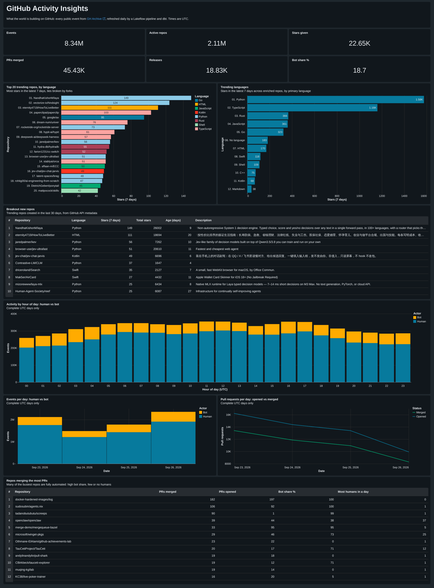
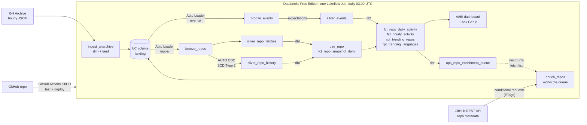
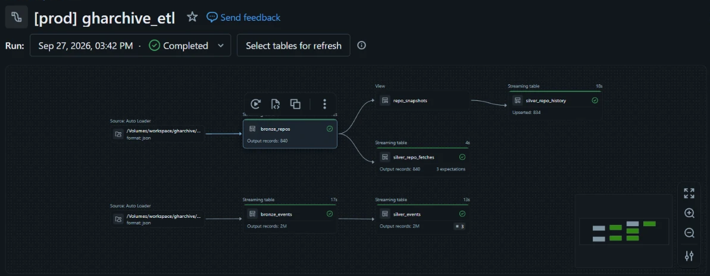

# GitHub Archive: End-to-End Data Pipeline

[](https://github.com/leon2378/github-archive-e2e-pipeline/actions/workflows/ci.yml)

**What is the world building right now?** This project is an end-to-end lakehouse pipeline on
Databricks. It turns every public GitHub event from [GH Archive](https://www.gharchive.org)
(1.5–3 million a day: pushes, pull requests, stars, forks and releases) into trending-repo
rankings and activity analytics. The repos that matter are enriched from the GitHub REST API
(language, topics, license, age), and their attributes are tracked over time as a Type 2 slowly
changing dimension.



*The **GitHub Activity Insights** AI/BI dashboard on production data from Sep 23–27, 2026
(8.34M events across 2.11M active repos), deployed as code with the rest of the pipeline.
[PDF version](docs/dashboard.pdf)*

## Results

Measured in production, Sep 23–29, 2026:

| | |
|---|---|
| Events processed | 5.37M in the initial 3-day backfill (Sep 23–25), then 2.4M–3M a day |
| Daily run time | ~9 minutes end to end on serverless: ingestion (1.4 min) and enrichment (4 min) in parallel, then the pipeline (2 min) and dbt (3 min) |
| Landed data volume | −55% from payload slimming at ingestion |
| Data quality | 9 malformed events dropped by expectations, 3 duplicate events flagged, 0 rescued rows |
| Repo enrichment | 836 repos fetched from the GitHub API in one run (835 found, 1 deleted), within the token's hourly limit |
| Enrichment coverage | 91–95 of the top 100 trending repos have metadata; repos that start trending are filled in on the next run |
| History tracking | 6 real changes captured by the SCD Type 2 table in its first 3 days, including a rename (`godseye` → `pip-scout`), a TypeScript → Rust rewrite and a license change to MIT |
| Test coverage | 29 pytest tests, 40 dbt data tests, 5 dbt unit tests, source freshness checks |
| Deployment | Every push to `main` is linted, tested, validated and deployed by CI |

## Architecture



The Lakeflow pipeline in production, with two Auto Loader flows. Events: `bronze_events` →
`silver_events` (2M rows in this run). Repos: `bronze_repos` → `silver_repo_fetches` (the fetch
log, with expectations) and, through the `repo_snapshots` view, `silver_repo_history` (SCD Type 2
via `AUTO CDC`, 834 repos upserted).



## Tech stack

| Layer | Tool |
|---|---|
| Ingestion | Python 3.12, httpx, orjson, Databricks SDK, run as **Lakeflow Job** tasks on serverless; **GitHub REST API** with conditional requests |
| Storage | **Unity Catalog** volume (landing) + **Delta Lake** tables with liquid clustering |
| Processing | **Auto Loader** + **Lakeflow Spark Declarative Pipelines** (PySpark, serverless), **AUTO CDC** for SCD Type 2 |
| Data quality | Pipeline **expectations**, **dbt** data and singular tests, dbt **unit tests**, source freshness |
| Transformation | **dbt** (dbt-databricks) on a serverless SQL warehouse |
| Orchestration | **Lakeflow Jobs**: ingestion → enrichment → pipeline → dbt, on one schedule |
| Infra as code / CI/CD | **Declarative Automation Bundles** (formerly Asset Bundles) + GitHub Actions |
| Serving | **AI/BI dashboard** + **Genie** (natural-language questions over the gold tables) |
| Tooling | venv or conda, pip, **ruff**, **pytest** |

## Design decisions

The key choices, and the trade-offs behind them.

- **Slim at ingestion.** Ingestion keeps each event's envelope plus its scalar payload fields,
  and drops nested objects (avatar/URL blocks, PR and issue bodies). That roughly halves the data
  to land and store (−55% measured), and gives one uniform bronze shape across ~18 event types.
  Trade-off: dropped fields can't be recovered from bronze, so the ingestion script is the one
  place to change if a new metric needs them.
- **One orchestrator for the whole run.** Extraction first ran on GitHub Actions, on the assumption
  that Free Edition compute couldn't reach outside websites. Then GitHub's scheduler never fired
  for this repo: zero scheduled runs across three attempts on two nights, with no incident
  reported. Testing egress from serverless compute showed GH Archive and the GitHub API are both
  reachable, so ingestion moved into the Lakeflow Job as its first tasks. One scheduler, which
  has fired on time every night, now runs everything in order, and GitHub Actions is left to
  CI/CD and manual backfills. Files still land in a volume before processing, which keeps
  extraction replayable and separate from transformation.
- **Idempotent, self-healing ingestion.** Files are named by hour and skipped if already present,
  so the daily run uses an overlapping 48-hour window. A missed run fixes itself the next day,
  and backfills can be re-run safely. Auto Loader tracks processed files, so no file is loaded
  twice. Enrichment runs at most once per UTC day, so a rerun never spends API quota twice.
  Events that GH Archive itself repeats are caught by a dbt `unique` test instead.
- **Explicit bronze schema with rescued data.** New or unexpected fields go to `_rescued_data`
  instead of breaking the stream. `payload` has a different shape for each event type, so it's
  kept as JSON text and parsed in silver.
- **A Lakeflow pipeline for bronze and silver, dbt for business logic.** Bronze and silver run in
  a Lakeflow pipeline, which has Auto Loader, streaming and expectations built in. Gold lives in
  dbt, where business logic is plain SQL that is version-controlled, tested, and portable to
  other warehouses.
- **Enrichment driven by a dbt queue.** Which repos are worth an API call (trending, most active,
  stale refreshes) is decided by a dbt model, versioned and unit-tested with the rest of the SQL.
  The Python job just works the queue from the top, so business rules never hide in extraction
  code.
- **Conditional requests to stay within quota.** A read-only GitHub token, kept in a Databricks
  secret scope, allows 5,000 requests an hour. The queue carries each repo's last ETag, and a
  repo that hasn't changed answers 304, which doesn't count against the limit, so re-checking it
  is free. Busy repos change daily and still cost a request; the savings come from the weekly
  refresh of quieter repos. The job stops cleanly when quota runs low, and missing or blocked
  repos are recorded and skipped for 30 days instead of being retried every run.
- **Slowly changing attributes vs fast-moving metrics.** Name, owner, language, topics, license
  and status are tracked as a Type 2 slowly changing dimension with `AUTO CDC`, so renames and
  transfers keep their history. Stars and forks change daily, so they go into a periodic snapshot
  fact instead; otherwise every active repo would get a new version every day.
- **Fetch log separate from history.** Every API attempt (200, 304, 404, …) lands in
  `silver_repo_fetches`, but only successful fetches feed the history. A 304 or 404 carries no
  attributes and would otherwise blank out a repo's history. The fetch log supplies ETags,
  availability and last-checked times instead.
- **Stable keys.** Facts join to `dim_repo` on `repo_id`, which survives renames and ownership
  transfers. Names are for display only.
- **An accepted one-day lag.** A repo that starts trending today is enriched on the next run, so
  it shows as "not enriched yet" for a day. Running the pipeline a second time after enrichment
  would remove the lag but double the daily compute.
- **Quality gates at two layers.** Pipeline expectations drop invalid rows and flag unknown event
  types and HTTP statuses, with results in the pipeline UI. dbt tests enforce grain and value
  ranges; unit tests check the trending, language, snapshot, dimension and queue logic against
  hand-computed results; and a singular test checks that every repo's history is an unbroken
  chain with exactly one current version.
- **Incremental models that handle late data.** Gold facts recompute only the dates that received
  new rows (tracked with `_loaded_through`) and merge them. Backfilling last month fixes last
  month's aggregates without a full refresh.
- **Dev/prod isolation with safe deploys.** Each target gets its own schemas, pipeline, job and
  dashboard. Dev schedules are paused, and dev runs stay small (a 3-hour look-back and 50 API
  calls) to save Free Edition's daily quota. CI deploys prod from `main`, and it refuses
  destructive changes (anything that deletes or recreates a resource) until someone reviews the
  plan and approves it by hand.
- **Dashboard as code.** The AI/BI dashboard is a JSON file in the repo. Its queries use
  unqualified table names, and each target points them at its own gold schema, so the dev and
  prod dashboards come from one definition.
- **Freshness monitoring.** `dbt source freshness` warns after 36 hours without new data and fails
  the job after 72. This catches silent upstream failures, such as GH Archive pausing publication
  or an ingestion task failing several nights in a row.

## The data

Measured by this pipeline on 3 days of production data (Sep 23–25, 2026, 72 hours):

| | |
|---|---|
| Events | 35K–108K per hour depending on time of day (avg 75K), 1.5–2.1M per day |
| Mix | PushEvent 79%, CreateEvent 11%, DeleteEvent 3%, PullRequestEvent 2%, everything else ~4% |
| Stars (WatchEvent) | ~250/hour (~6K/day): a sparse signal, so trending ties are broken by forks |
| Bots | 18% of all events, 34% of PR events and 54% of issue comments |
| Size | −55% after slimming (110.5 MB raw → 50.2 MB, measured on 8 sample hours) |
| Duplicates | 3 repeated event IDs in 5.37M events, flagged by the dbt `unique` test |

Daily volume swings widely: from 1.48M events on Thursday Sep 24 to 2.96M on Sunday Sep 27. A few
more weeks of history will show whether there's a weekly pattern.

From the first repo enrichment run (Sep 26, 2026, 835 repos):

| | |
|---|---|
| Trending languages | Python 33% and TypeScript 26% of trending-window stars; Rust, JavaScript and Go ~7–8% each |
| New repos | 20 of the top 100 trending repos are under 30 days old; #1 is 8 days old with 25K stars |
| Repo metadata | 16 distinct licenses, 6.2 topics per repo on average, 2% with no primary language |

Since GitHub's 2025 Events API changes, payloads are much thinner: pushes no longer list their
commits, and pull request merges arrive as `action = 'merged'`.

## Data model

| Table | Layer | Grain | Built by |
|---|---|---|---|
| `bronze_events` | bronze | one row per event, as landed | Auto Loader streaming table |
| `silver_events` | silver | one row per event, typed + validated | streaming table with expectations |
| `bronze_repos` | bronze | one row per GitHub API fetch attempt, as landed | Auto Loader streaming table |
| `silver_repo_fetches` | silver | one row per fetch attempt: outcome, ETag, metrics | streaming table with expectations |
| `silver_repo_history` | silver | one row per repo version (SCD Type 2) | `AUTO CDC` |
| `stg_gharchive__*` | staging | same as the silver table | dbt views |
| `int_repo_latest_fetch` | intermediate | repo: last check, ETag, availability, metrics | dbt view |
| `dim_repo` | gold | repo (current version) | dbt table |
| `fct_repo_daily_activity` | gold | repo × day | dbt incremental (merge) |
| `fct_hourly_activity` | gold | day × hour × event type | dbt incremental (merge) |
| `fct_repo_snapshot_daily` | gold | repo × day (periodic snapshot) | dbt table |
| `rpt_trending_repos` | gold | one row per trending repo | dbt table |
| `rpt_trending_languages` | gold | language | dbt table |
| `ops_repo_enrichment_queue` | ops | repo to fetch on the next run | dbt table |

Bronze and silver live in `workspace.gharchive`; dbt writes gold to `workspace.gharchive_gold`.
The dev target uses `gharchive_dev` and `gharchive_dev_gold`.

## Repository layout

```
databricks.yml                  bundle root: variables, dev/prod targets
resources/                      schema + volume, pipeline, job and dashboard definitions
ingestion/gharchive.py          extract: GH Archive -> slim -> UC volume (idempotent)
ingestion/github_repos.py       enrich: GitHub REST API -> UC volume, driven by the dbt queue
ingestion/sinks.py              shared landing targets (UC volume, or a local folder)
src/jobs/                       Lakeflow Job task wrappers that run the two ingestion scripts
src/gharchive_etl/              Lakeflow pipeline: events and repos, bronze -> silver (+ SCD2)
src/models/                     dbt: staging, intermediate, gold marts, ops queue (+ unit tests)
src/tests/                      dbt singular tests (repo history integrity)
src/macros/                     dbt macro for late-arriving-data-safe incremental models
src/dashboards/                 AI/BI dashboard definition (deployed per target)
dbt_project.yml, packages.yml   dbt project config (package-lock.yml pins dbt_utils)
dbt_profiles/profiles.yml       dbt connection profiles (job + local)
tests/                          pytest suite for both ingestion jobs
requirements*.txt               Python dependencies (runtime, dev, local dbt)
docs/                           dashboard and pipeline screenshots, dashboard PDF
.github/workflows/              ci.yml (lint/test/validate/deploy), backfill.yml (manual backfills)
```

## Getting started

### 1. One-time setup

1. Create a free account at [Databricks Free Edition](https://www.databricks.com/learn/free-edition).
2. Create a Databricks personal access token for GitHub Actions (CI/CD): **Settings → Developer →
   Access tokens**. Copy it right away. Databricks shows it only once.
3. Install the Databricks CLI (Windows shown; on macOS/Linux use Homebrew or the curl installer):
   ```powershell
   winget install Databricks.DatabricksCLI
   ```
4. Authenticate the CLI (use your workspace URL):
   ```powershell
   databricks auth login --host https://<your-workspace>.cloud.databricks.com --profile DEFAULT
   ```
5. Create a read-only GitHub token for repo enrichment. On GitHub, go to **Settings → Developer
   settings → Personal access tokens → Fine-grained tokens → Generate new token**, choose
   **Public repositories (read-only)** and add no permissions. Store it in a Databricks secret
   scope; the second command prompts for the token, so it never ends up in your shell history:
   ```powershell
   databricks secrets create-scope gharchive
   databricks secrets put-secret gharchive github_token
   ```
   Pasting into that hidden prompt can pick up an invisible character (it happened here: a
   NUL). The job strips control characters and whitespace from the token, so it still works.
6. Create a Python environment and install dependencies, with **either** venv:
   ```powershell
   python -m venv .venv
   .venv\Scripts\Activate.ps1          # macOS/Linux: source .venv/bin/activate
   pip install -r requirements-dev.txt
   ```
   **or** conda:
   ```powershell
   conda create -n gharchive python=3.12 -y
   conda activate gharchive
   pip install -r requirements-dev.txt
   ```
7. Check everything works: `pytest` and `ruff check .`

### 2. Deploy and run in dev

```powershell
# Create the dev schema, landing volume, pipeline and job
databricks bundle deploy -t dev

# Run the whole job: ingest the last 3 hours of GH Archive, enrich up to 50 queued repos, run the
# pipeline, then dbt. Dev runs are kept small to save Free Edition's daily compute quota.
databricks bundle run gharchive_daily -t dev
```

On a fresh workspace, run the job twice: the first run builds the enrichment queue, and the
second enriches the repos in it.

Want to see the ingestion without Databricks? Write to a local folder instead:
`python -m ingestion.gharchive --start 2026-09-01T00 --end 2026-09-01T01 --output-dir data`

### 3. Go to production with GitHub Actions

1. Push this repo to GitHub (public repos get unlimited Actions minutes).
2. Add repository secrets `DATABRICKS_HOST` (your workspace URL) and `DATABRICKS_TOKEN`.
3. Push to `main`. **CI/CD** lints, tests, validates the bundle, then deploys the `prod` target.
4. The prod job runs daily at 03:00 UTC: GH Archive ingestion, repo enrichment, the pipeline and
   dbt, in that order. It emails you if anything fails.
5. To backfill history, open **Manual backfill** in the Actions tab, click **Run workflow**, and
   enter a `start`/`end` range. The next daily run processes the backfilled files.
6. If a change deletes or recreates a resource (for example, renaming one), CI stops at
   **Deploy to prod** instead of applying it. Review the plan, apply it yourself, then re-run the
   failed job in the Actions tab:
   ```powershell
   databricks bundle plan -t prod
   databricks bundle deploy -t prod --auto-approve
   ```

### 4. The dashboard

The **GitHub Activity Insights** AI/BI dashboard is deployed with the bundle, like the pipeline
and job. Find it under **Dashboards** as `[dev] GitHub Activity Insights` or
`[prod] GitHub Activity Insights`. It contains:

- KPIs: events, active repos, stars, PRs merged, releases, and bot share
- the top 20 trending repos coloured by language, next to the trending languages
- breakout new repos: trending repos created in the last 30 days, with their total stars
- activity by hour of day split into human vs bot
- events per day (human vs bot) and pull requests opened vs merged per day
- the repos merging the most PRs, with how automated each one is

The hourly and daily charts use complete UTC days only (all 24 hours loaded), so a partial
latest day doesn't inflate its hours or show a false drop.

The dashboard is defined in `src/dashboards/gharchive_insights.lvdash.json`. Its queries use
unqualified table names, and `dataset_schema` in `resources/gharchive.dashboard.yml` points them at
the right gold schema for each target. To change it, edit the dev dashboard in the UI, then pull
the changes back into the repo:

```powershell
databricks bundle generate dashboard --resource gharchive_insights --force
```

Every published dashboard also has **Ask Genie**, so viewers can ask questions in plain English,
like "which repos merged the most pull requests this week?"

### Running dbt locally (optional)

```powershell
pip install -r requirements-dbt.txt
$env:DBT_HOST = "<your-workspace>.cloud.databricks.com"
$env:DBT_ACCESS_TOKEN = "<your token>"
$env:DBT_WAREHOUSE_ID = "<warehouse id from SQL Warehouses → Connection details>"
dbt deps --profiles-dir dbt_profiles
dbt build --profiles-dir dbt_profiles
```

## Running on Databricks Free Edition

The whole project runs on the free tier, which shaped a few of the choices above:

- **Serverless only, with daily compute quotas.** Backfills run a few days at a time.
- **One SQL warehouse** (the 2X-Small "Serverless Starter Warehouse"), shared by dbt and the
  dashboard.
- **One active pipeline per pipeline type,** so the dev and prod pipelines can't run at the same
  time.
- **Outbound internet limited to trusted domains.** GH Archive, the GitHub API and PyPI are all
  on the list (tested from serverless compute), so extraction runs inside the Lakeflow Job.

## Future improvements

- **Fresher data:** run the job every few hours instead of daily, now that ingestion is part of
  it (budget permitting: Free Edition has daily compute quotas).
- **Same-day enrichment:** run the pipeline again after enrichment, so new trending repos get
  their metadata the same day.
- **Spark unit tests:** test the pipeline transformations locally with Databricks Connect.
- **Streaming:** add a real-time source such as the Bluesky Jetstream firehose.
- **LLM enrichment:** classify trending repos by topic with `ai_query()`.
- **Metric views:** define "stars", "active repos" and similar metrics once, in Unity Catalog
  metric views.
- **Richer dashboard:** add a weekday × hour heatmap and a date-range filter as history builds up.
